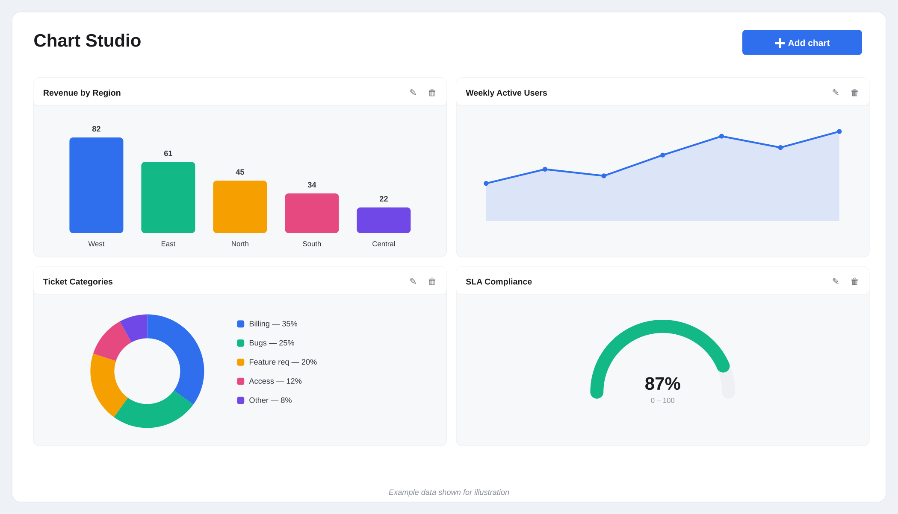

<p align="center">
  
</p>

<h1 align="center">SPFx Chart Studio</h1>

<p align="center">
  A SharePoint Framework web part that's a multi-chart canvas — drop in one chart, or a dozen,
  each independently backed by its own SharePoint list, chart type, and field mapping.
</p>


## Preview



*Shown with mock data for illustration — live data is pulled from the SharePoint lists you configure per chart.*

## Why this exists

Most chart web parts give you one chart type wired to one list. The moment you need a bar chart
next to a gauge next to a doughnut on the same page, you're stacking three separate web part
instances with three separate configuration experiences. Chart Studio is one instance that acts
as a canvas: add as many chart tiles as the page needs, configure each independently, and let
viewers see a clean read-only dashboard.

## Features

- **One web part, many charts** — add, edit, and remove chart tiles from an in-canvas "Add chart" control; nothing to configure per extra web part instance.
- **10 chart types** — Bar, Grouped bar, Stacked bar, Line, Area, Pie, Doughnut, Radar, Scatter, and a custom-built Gauge (SVG, since this isn't a native Chart.js type).
- **Per-tile data mapping** — each tile picks its own SharePoint list and maps category/value/series (or X/Y for scatter, min/max/target for gauge) independently.
- **Series splitting** — group or stack any category chart by a second field (e.g. revenue by region, split by quarter).
- **4 color themes per tile** — Vivid, Cool, Warm, Mono.
- **Half or full-width tiles** — lay out a 2-column grid or dedicate a full row to one chart.
- **Editor-only configuration** — the config panel only appears in page edit mode; regular viewers just see the rendered dashboard, no edit affordances.
- **Standard SharePoint look and feel** — the tile config panel uses Fluent UI's native slide-in `Panel`, grouped sections, and footer action buttons — the same visual language as SharePoint's own property pane, not a custom modal.
- **Fully permission-aware** — reads through the current user's own SharePoint session (`SPHttpClient`); never bypasses list permissions.

## How it's built

- **Framework:** SharePoint Framework (SPFx) 1.23, React, TypeScript
- **Build system:** Heft
- **UI:** Fluent UI (`@fluentui/react`) — `Panel`, `Dropdown`, `ChoiceGroup` for the config experience
- **Charts:** Chart.js via `react-chartjs-2` for 9 of the 10 types; a hand-built SVG arc for the Gauge
- **Data access:** `SPHttpClient` against `_api/web/lists/getbytitle(...)/items` and `.../fields`, with pagination handling
- **State:** tile configuration is stored as JSON in the web part's own properties, so the whole canvas saves and loads with the page like any other web part — no external storage needed

## Configuring a chart tile

Each tile's config panel is grouped into three sections, opened from the "Add chart" button or a
tile's edit icon (both visible only in edit mode):

1. **Appearance** — title, tile width (half/full), color theme
2. **Chart type** — pick from the 10 supported types
3. **Data source** — list name, then field pickers scoped to that list:
   - Category/value charts (bar, line, pie, radar, etc.): category field, value field, optional series field
   - Scatter: X field, Y field, optional series field
   - Gauge: value field (summed), min, max, optional target marker

## Getting started (development)

```bash
npm install
npm run serve
```

This opens the local SPFx workbench for development. To package for deployment:

```bash
npm run build
gulp bundle --ship
gulp package-solution --ship
```

This produces a `.sppkg` package under `sharepoint/solution/`, ready to upload to a SharePoint App Catalog and deploy to any site in a tenant.

## Disclaimer

Provided as-is, without warranty of any kind.
